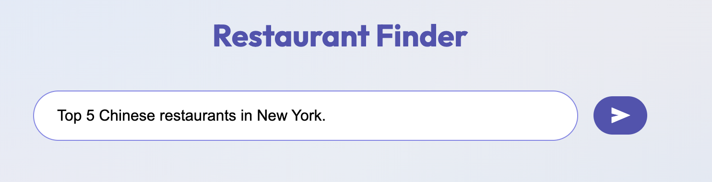
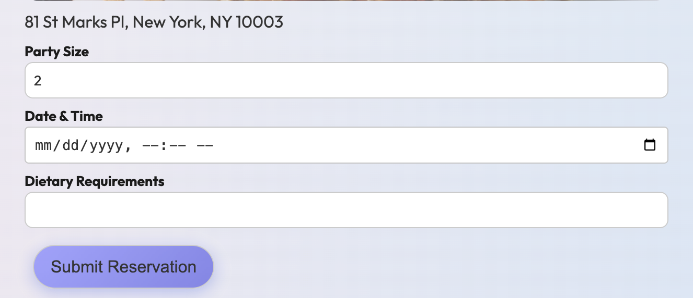
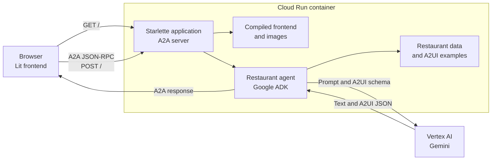

# Restaurant Finder Cloud Run deployment

This directory contains the complete Restaurant Finder deployment. It includes the compiled Lit frontend, the Python A2A agent, the A2UI Python SDK code used by the agent, and the Cloud Run build files. Building and deploying do not read files outside this directory.

## Screenshots

<p align="center">
  
  
  
</p>

## How the app and agent work

The container runs one Python process on the port assigned by Cloud Run. Its Starlette application handles the A2A routes and serves the compiled Lit frontend and restaurant images. Keeping both parts on one origin lets the browser call the agent without a separate API host or CORS configuration.



1. The browser loads the compiled Lit application from `/`.
2. The frontend reads `/.well-known/agent-card.json` to discover the agent URL and its supported A2UI extensions. The card uses the same canonical Cloud Run URL as the page.
3. A user message is sent to `/` as an A2A JSON-RPC request. The request identifies the A2UI protocol version supported by the frontend.
4. The A2A request handler passes the message to the restaurant agent. The agent uses an ADK runner and the bundled restaurant data to prepare the model request. Image references are rewritten to the service's `/static` URLs.
5. Gemini generates the answer and the A2UI JSON that describes the interface. The bundled A2UI SDK validates and converts that output into A2A response parts.
6. The Lit client reads those parts and renders the returned components. Later form actions are sent through the same A2A route so the agent can continue the interaction.

Sessions, memory, artifacts, and A2A tasks are stored in memory inside each container instance. They are cleared when an instance stops, and they are not shared between instances.

## Configure the deployment

Copy the sample environment file before building or deploying:

```bash
cp .env.example .env
```

Edit `.env` to select the Google Cloud project, Cloud Run service and region, Vertex AI location, model, memory, and local Docker image name. Both `build.sh` and `deploy.sh` load this file automatically. Values in the file take precedence over inherited shell variables. Set `ENV_FILE` to use a file at another path.

## Build locally

Docker is required for a local build.

```bash
./build.sh
```

The image name comes from `.env`. To build with a different configuration file, set `ENV_FILE`:

```bash
ENV_FILE=/path/to/test.env ./build.sh
```

## Deploy to Cloud Run

Install the Google Cloud CLI, authenticate it, and run:

```bash
./deploy.sh
```

The sample `.env.example` uses:

* Project: `xxx`
* Service: `restaurant-finder`
* Cloud Run region: `us-central1`
* Vertex AI location: `global`
* Model: `gemini-3-flash-preview`
* Memory: `1Gi`

To deploy with a different configuration file, set `ENV_FILE`:

```bash
ENV_FILE=/path/to/production.env ./deploy.sh
```

The deployment uses Vertex AI and the Cloud Run runtime identity by default. To use a Gemini API key stored in Secret Manager, provide the existing secret's name:

```bash
GEMINI_API_KEY_SECRET=my-gemini-key ./deploy.sh
```

The service is public because the frontend calls the A2A endpoint directly. The agent stores sessions and tasks in memory, so they are lost when an instance stops or traffic moves to another instance.
